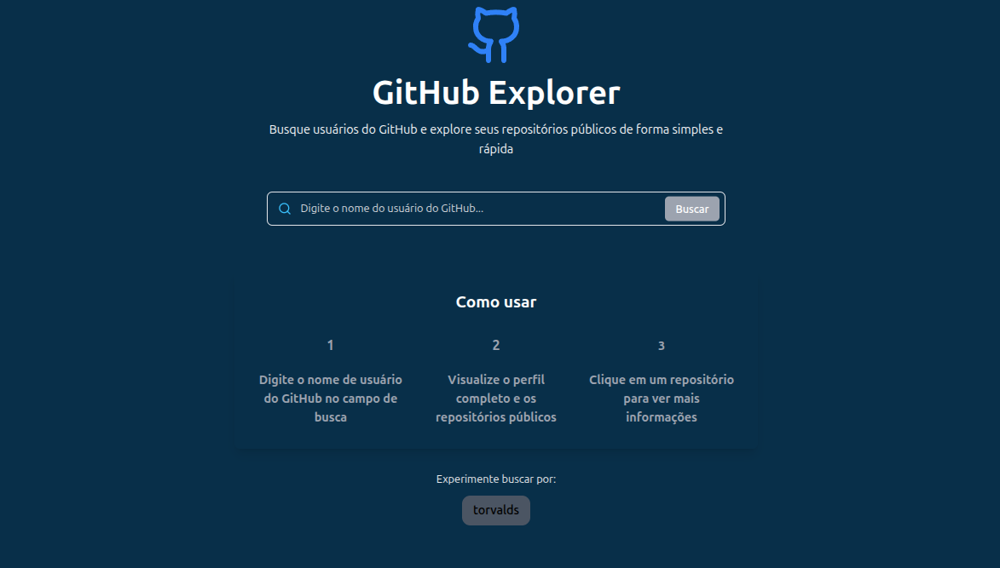
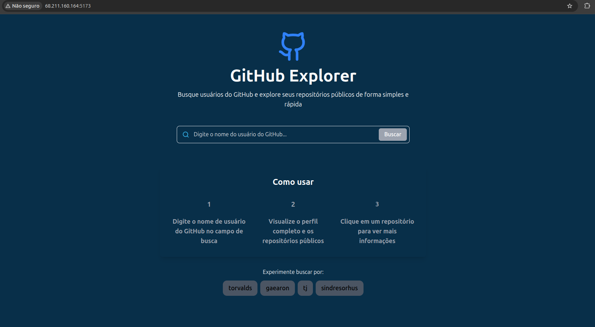
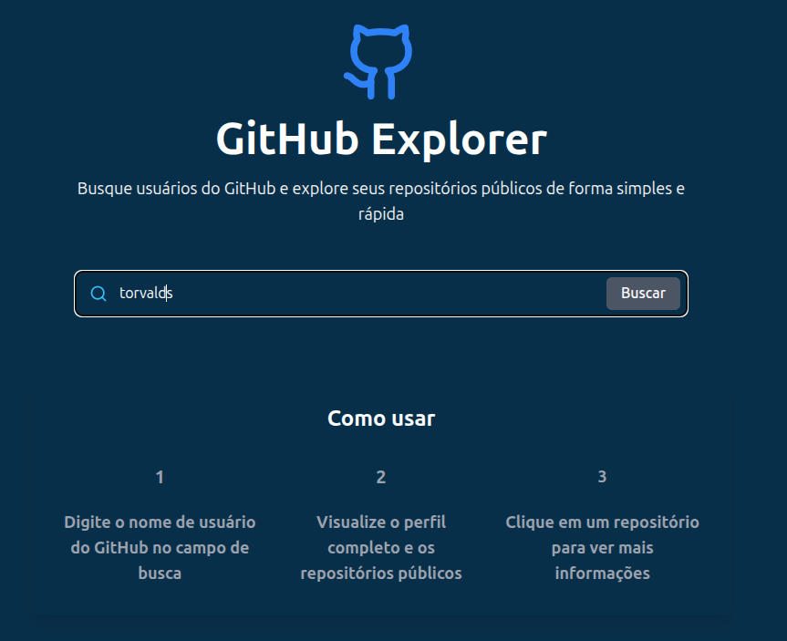
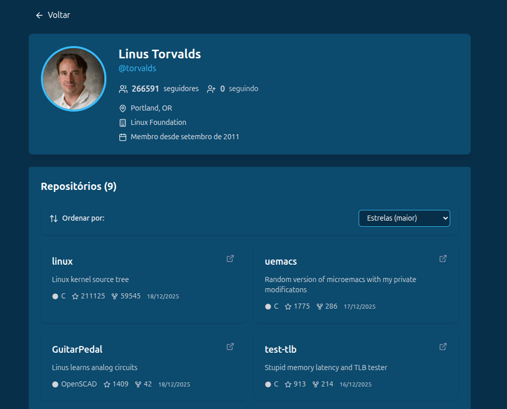
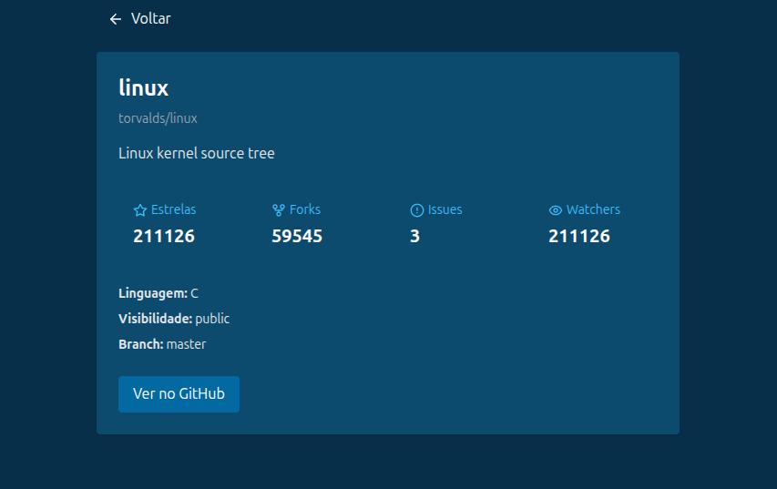
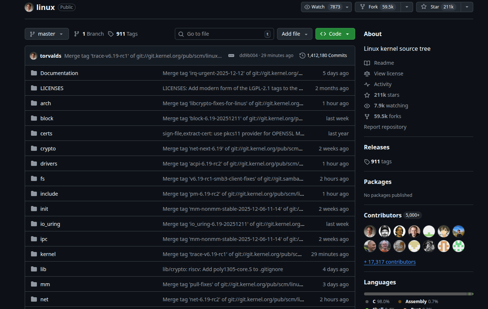

# GitHub Explorer

---

Se trata de uma SPA (Single Page Application) que realiza a partir de um nome de usuário uma busca na API pública do GitHub. Retornando dados referentes ao usuário e os seus respectivos repositórios.



---

# Tecnologias Utilizadas

### Frontend
- [Node](https://nodejs.org/) - Runtime JavaScript
- [React](https://react.dev/) - Biblioteca para construção de interfaces
- [TypeScript](https://www.typescriptlang.org/) - Superset JavaScript com tipagem estática
- [React Router](https://reactrouter.com/) - Roteamento e navegação
- [Axios](https://axios-http.com/) - Cliente HTTP para requisições à API
- [Tailwind CSS](https://tailwindcss.com/) - Framework CSS utility-first
- [Vite](https://vitejs.dev/) - Build tool e dev server

### DevOps / Infraestrutura
- [Docker](https://www.docker.com/) - Containerização da aplicação
- [Nginx](https://nginx.org/) - Servidor web que serve os arquivos estáticos e gerencia roteamento SPA
- [Azure VM](https://azure.microsoft.com/pt-br/products/virtual-machines/) - Hospedagem em máquina virtual

### API
- [GitHub REST API](https://docs.github.com/pt/rest) - API pública do GitHub para busca de usuários e repositórios

---

# Como Usar

```bash
    # clonar o projeto
    git clone https://github.com/DanielDeAzevedoCordeiro1/GitHub-Explorer.git
```

```bash
    # Acesse a pasta do projeto
    cd GitHub-Explorer
```

```bash
    # Faça instalação das dependências
    npm i
```

```bash
    # Rode o servidor
    npm run dev
```

---

# Acesse a Opção Hospedada na Azure

- [Endereço hospedado](http://68.211.160.164:5173/) - Clique e acesse a aplicação hospedada em uma VM na Azure.



---

# Visão Geral (Fluxo de Funcionamento)

### Passo 1:

O usuário insere o nome do Repositório 



### Passo 2

O usuário tem acesso às informações e aos repositórios



### Passo 3

Consegue acessar um repositório específico



### Passo 4

Consegue acessar um link que encaminha para o GitHub desejado



---

### Licença MIT